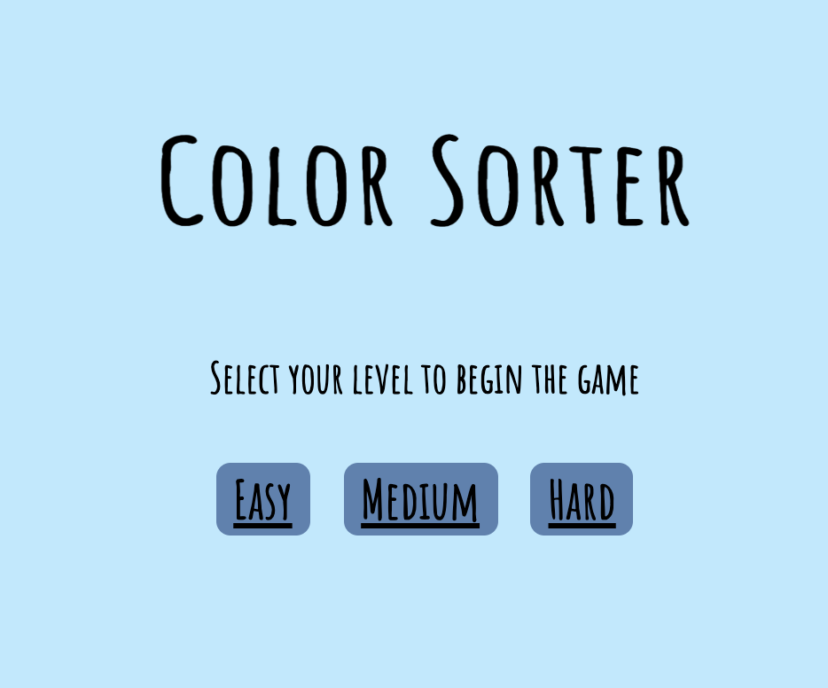
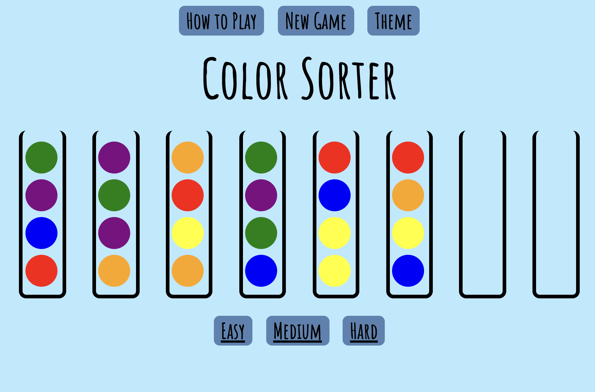
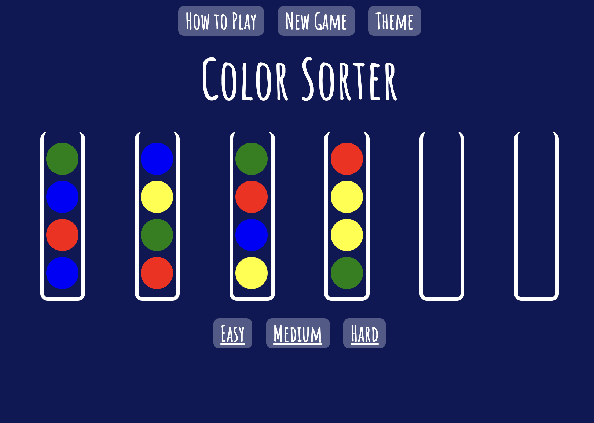
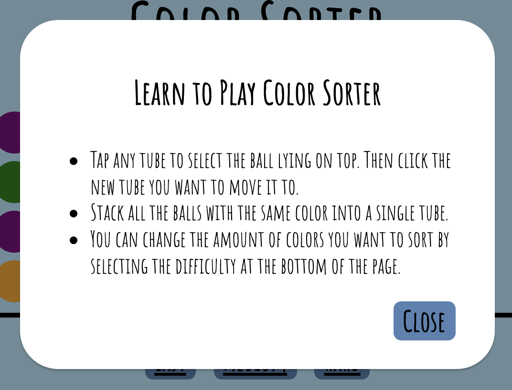
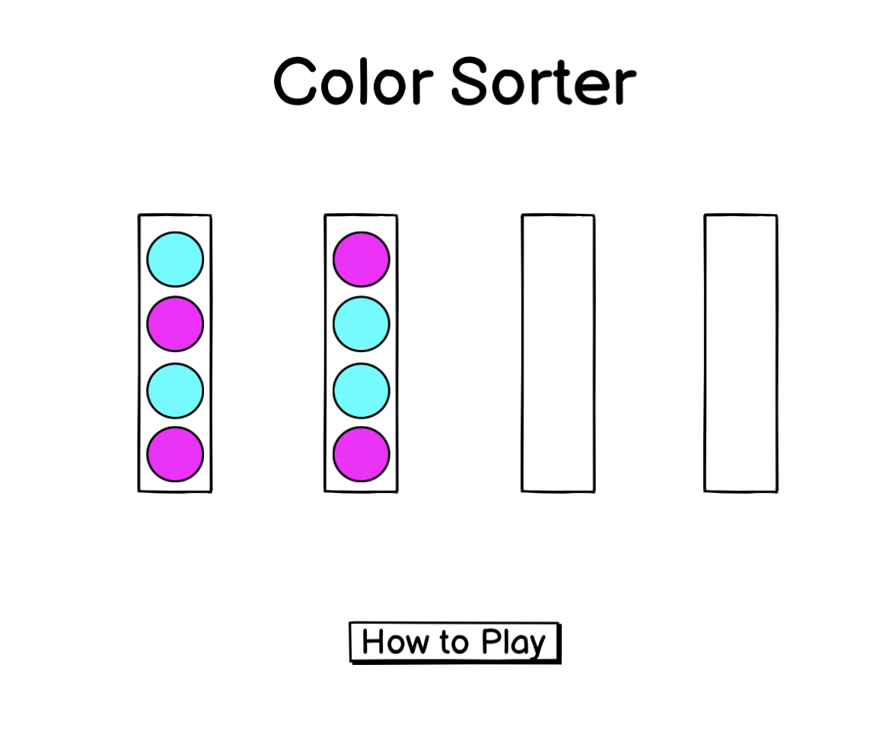
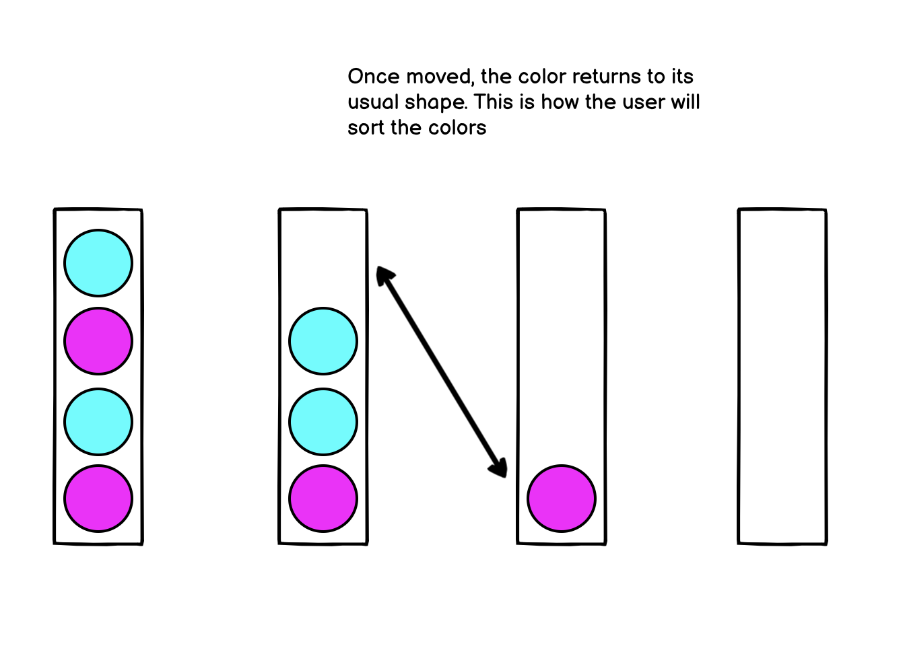
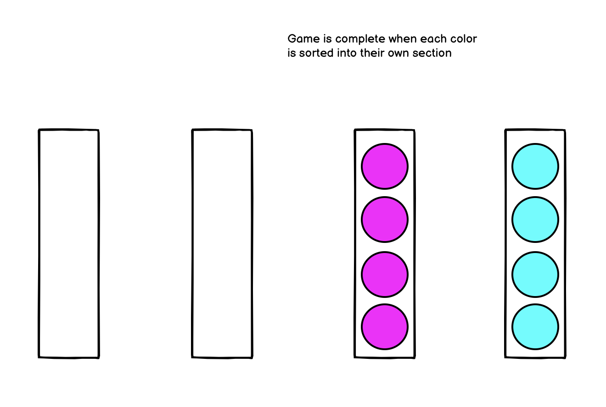

## Game Screenshots

## Description and Technologies

A brower-based color sorting game coded in Javascript, HTML, and CSS.
To play, select the amount of colors you would like to sort by changing the difficulty, then move the dots from tube to tube to sort them by color.

## Installation Instructions

Fork the repo and clone it down to your machine, then host on a live server!

## User Stories

### MVP Goals

- As a user, I want a browser-based interface so I can play the game.
- As a user, I want a "how to play" button to give me instructions on how the game works.
- As a user, I want to see a randomized colored dots appear in each container so I can see what needs to be sorted.
- As a user, I want the colored objects to identify themselves so I can see which object I have selected.
- As a user, I want to make sure that only the top shape in each container is movable.
- As a user, I want to be able to move the objects from one container to another so I can organize the containers.
- As a user, I want a new game button so I can start the round from the beginning.

### Stretch Goals

- As a user, I want a win screen to pop up once all of the colors are sorted so that I know that I have won.
- As a user, I want to play more than one level where I can choose the amount of colors/containers I need to sort.
- As a user, I want to see the objects move from container to container as an added animation.
- As a user, I want the ability to undo any move that I have made in case I made a mistake.
- As a user, I want to be able to add additional empty containers to make the level easier.
- As a user, I want to make the level more difficult by not being able to move similar colors on top of each other.
- As a user, I want to see a tracker to count the number of moves I have made.
  EXTRA EXTRA CREDIT: If the computer can calculate the least amount of moves to clear the level and compare your score to it

## Major Hurdles

- One of the biggest hurdles was figuring out how to move the correct dot within the DOM, since everything was created in Javascript and not in the HTML.
- It took more time than anticipated to select the proper elements and I struggled to find a way to compare the dots to one another since they aren't in a standard array. Because of this,

## Unsolved Problems

Once I figure out how to compare the DOM elements side by side, the next three hurdles will be easier to overcome. I found a [resource](https://www.geeksforgeeks.org/how-to-check-if-an-element-has-any-children-in-javascript/) where I can check the amount of items in a parent element so I will be attempting to implement this concept to check the dot styles and quantities side by side.

- Currently, there is no win state that lets the user know that they have completed the level. This will be accomplished by comparing the DOM elements within a single container, then applying this across all containers.
- There is a minor bug where a user can stack more dots than a container allows and they will squish to fit.
- Users can currently stack dots of different colors on top of each other. To make the game more challenging, I want to implement something to prevent this.

## Wire Frames

